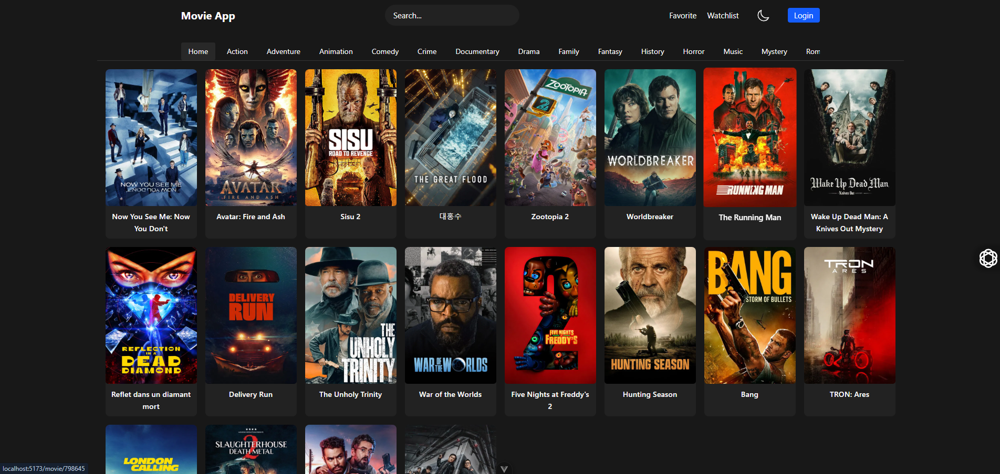

# Movie Discovery App

A movie discovery web application that allows users to browse movies, view detailed information, and save favorites using authentication.

## 🚀 Live Demo

👉 https://moviesdiscoveryapp.netlify.app/

## 🛠️ Built With

- Vue 3 (Composition API)
- Pinia (State Management)
- Firebase Authentication
- Firebase Firestore
- External Movie API

## ✨ Features

- **Browse & Discover**: Explore popular and trending movies.
- **Search**: Find movies by title with real-time feedback.
- **Movie Details**: View detailed information including overviews, ratings, and release dates.
- **User Authentication**: Secure login and registration powered by Firebase Auth.
- **Favorites & Watchlist**: Save movies to your personal lists (persisted via Firebase).
- **Dark/Light Theme**: Toggle application theme for comfortable viewing.
- **Responsive Design**: Optimized for various screen sizes using Tailwind CSS and Naive UI.

## 📸 Screenshots



## Tech Stack

- **Framework**: [Vue 3](https://vuejs.org/) (Composition API)
- **Build Tool**: [Vite](https://vitejs.dev/)
- **Styling**: [Tailwind CSS](https://tailwindcss.com/) & [Naive UI](https://www.naiveui.com/)
- **State Management**: [Pinia](https://pinia.vuejs.org/)
- **Backend/Auth**: [Firebase](https://firebase.google.com/)
- **API**: [The Movie Database (TMDB)](https://www.themoviedb.org/documentation/api)
- **Icons**: FontAwesome & Ionicons

## Project Setup

### Prerequisites

- Node.js (LTS version recommended)
- npm or yarn

### Installation

Clone the repository and install dependencies:

```sh
npm install
```

### Configuration (.env)

Create a `.env` file in the root directory. You need API keys for both Firebase and TMDB.

> [!IMPORTANT]
> Never commit your actual API keys to version control.

```env
# TMDB API Configuration
VITE_TMDB_API_KEY=your_tmdb_api_key_here

# Firebase Configuration
VITE_FIREBASE_API_KEY=your_firebase_api_key_here
VITE_FIREBASE_AUTH_DOMAIN=your_project.firebaseapp.com
VITE_FIREBASE_PROJECT_ID=your_project_id
VITE_FIREBASE_STORAGE_BUCKET=your_project.appspot.com
VITE_FIREBASE_MESSAGING_SENDER_ID=your_sender_id
VITE_FIREBASE_APP_ID=your_app_id
```

### Development

Run the development server with hot-reload:

```sh
npm run dev
```

### Production Build

Compile and minify for production:

```sh
npm run build
```

Previews the build:

```sh
npm run preview
```

### Linting

Lint and fix files:

```sh
npm run lint
```
